# Decagon 产品拆解 · 内部分享

> 材料来源：Decagon 官网 / 产品页 / 官方博客公开素材（2026）。  
> 截图目录：[`screenshots/`](./screenshots/)  
> 用途：京小灵对标讨论；非后台实机截图，部分为官网营销构图。

---

## 1. 一句话结论

**Decagon = 企业级「AI Concierge」平台**：用自然语言写 **AOP（Agent Operating Procedures）** 定义 Agent 行为，用 **Duet** 帮你建/测/改，用 **Watchtower** 对全量会话做常驻质检。

对京小灵最有价值的不是视觉皮，而是这条闭环：

**历史会话 → 意图与流程 → AOP/Tools → Simulation → 上线 → Watchtower QA → 再优化**

---

## 2. 它是谁

| 项 | 公开信息 |
|----|----------|
| 定位 | AI concierge for every customer（客服/会话 Concierge，非通用办公 Agent） |
| 渠道 | Chat / Voice / Email 同一智能层 |
| 核心原语 | **AOP**（自然语言工作流）+ **Tools** + **Guardrails** |
| 构建助手 | **Duet**（从转录生成 AOP、生成仿真、根因分析） |
| 质检 | **Watchtower**（自然语言打标、评分量表、仪表盘下钻） |
| 商业模式 | 纯销售驱动；无自助试用 / 无公开价目（第三方估六位数年费量级） |
| 客户信号 | Chime、Duolingo、ClassPass、Notion 等（官网案例） |

公开入口：

- 官网：https://decagon.ai  
- AOP：https://decagon.ai/product/aop  
- Watchtower：https://decagon.ai/product/watchtower  
- Duet 介绍：https://decagon.ai/blog/introducing-duet  

---

## 3. 产品骨架（Build → Optimize → Scale）

官网把平台拆成三步，和「可生成很多方案」相反——强调**可迭代的 Agent 生命周期**：

| 阶段 | Decagon 说法 | 做什么 |
|------|---------------|--------|
| Build | Build your agent | 用自然语言写 AOP；挂 Tools；设品牌/升级/幻觉护栏 |
| Optimize | Optimize your agent | Simulation、版本、A/B、推理可追溯 |
| Scale | Scale your agent | Watchtower + VoC 分析，把会话变成产品/运营洞察 |

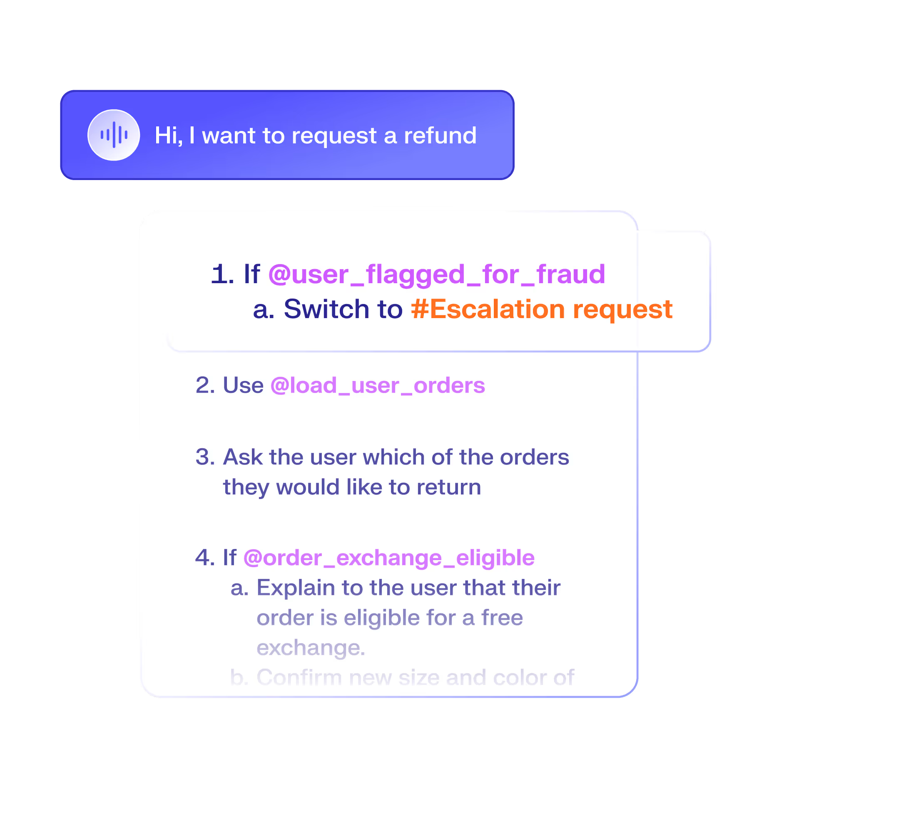

*图：Build — 退款请求如何展开为条件分支（欺诈升级 → 拉订单 → 追问 → 兑换资格）*

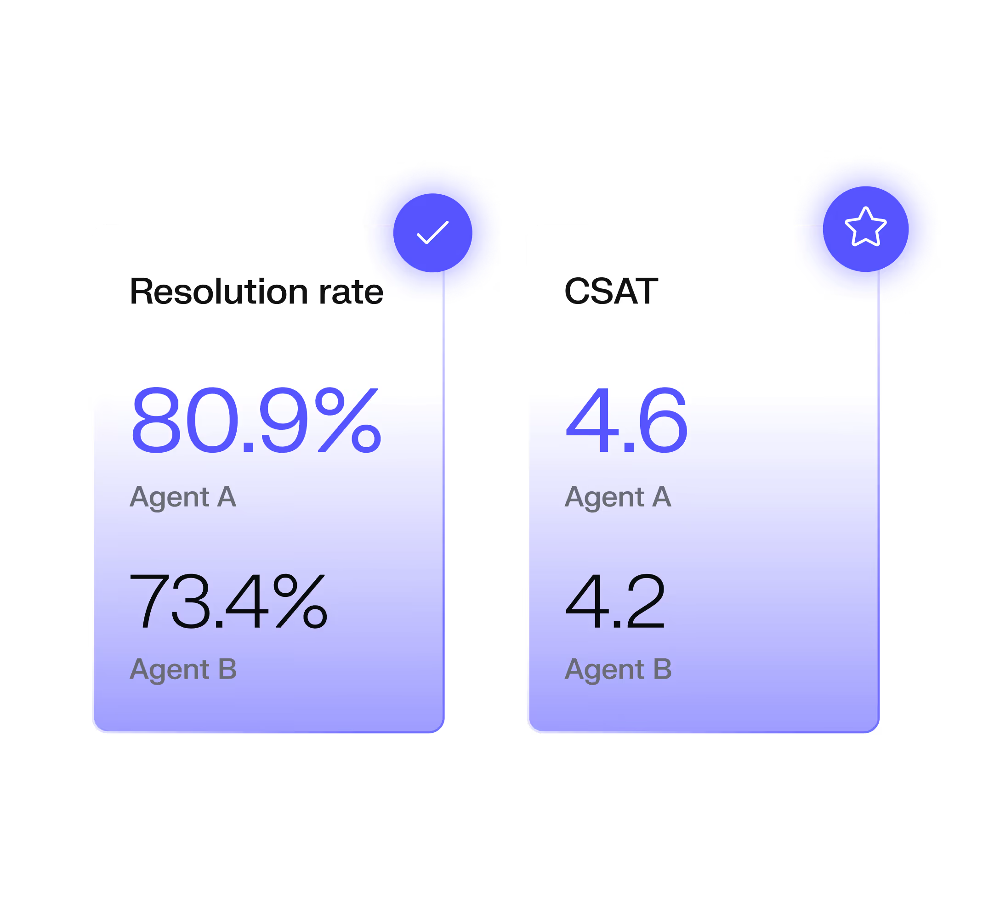

*图：Optimize — 官网「优化 Agent」构图*

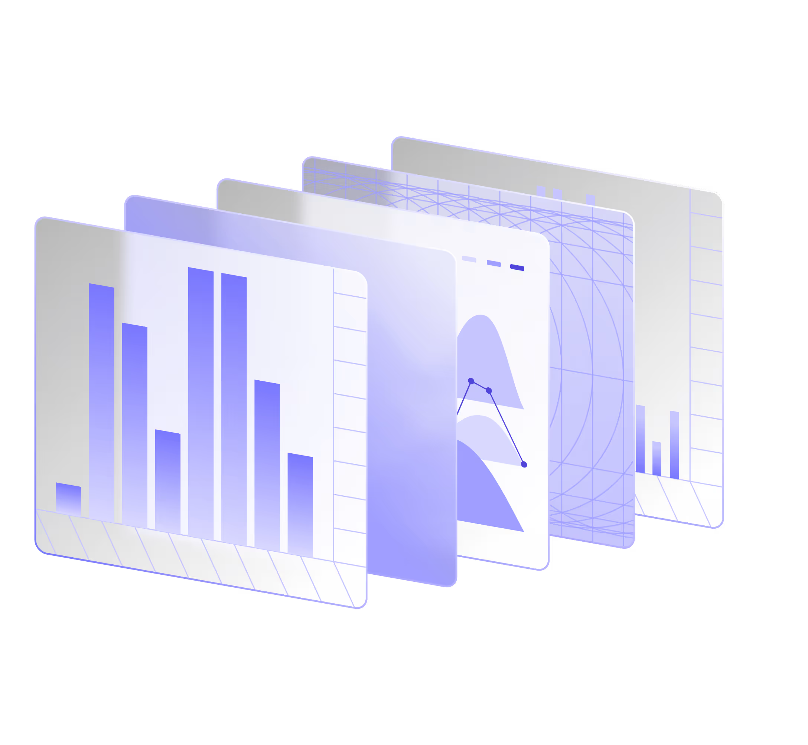

*图：Scale — 官网「规模化」构图*

---

## 4. 核心概念：AOP（最值得学）

### 4.1 是什么

AOP = 用**自然语言 SOP** 定义 Agent 工作流：

- Description / When to use / When not to use  
- 步骤里可引用 `@tool`、条件分支、升级路径  
- 工程侧可 Git 版本；业务侧可直接改文案逻辑  

官网主张：不要复杂 SDK / 黑盒 PS；像培训真人坐席一样写流程。

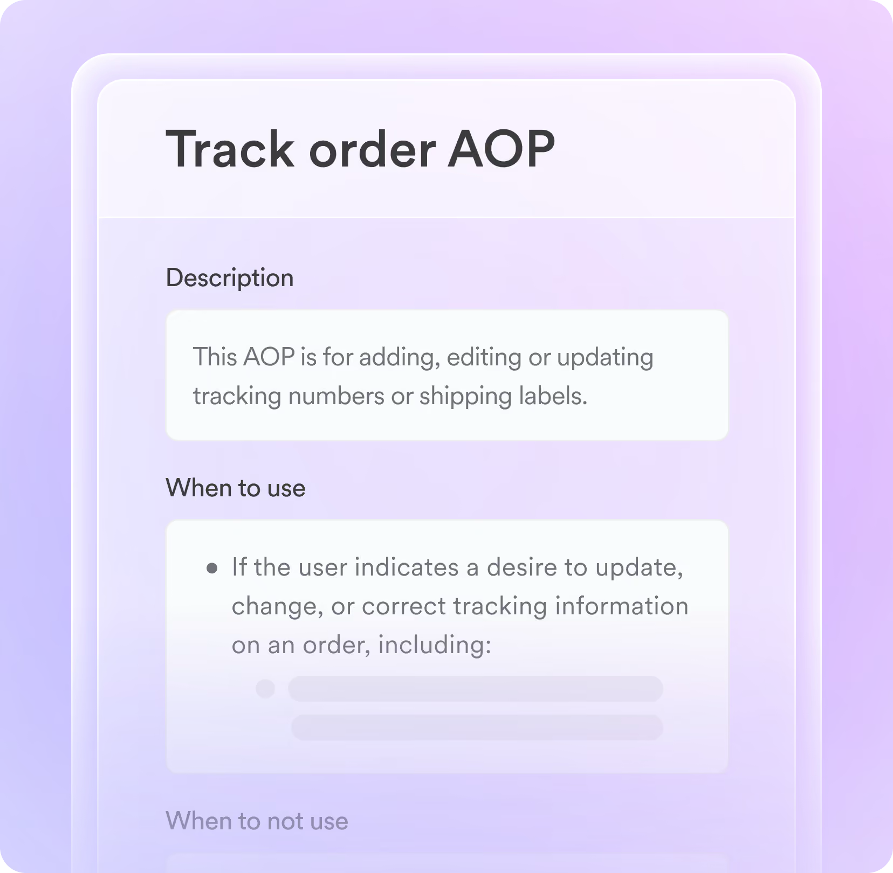

*图：Track order AOP — Description + When to use / not use 结构*

*图：退款流程中的 `If @user_flagged_for_fraud` / `@load_user_orders` 等可调用步骤*

### 4.2 对京小灵的映射

| Decagon | 京小灵近似能力 | 差距 / 可偷 |
|---------|----------------|-------------|
| AOP | 技能 / 话术 / 流程编排 | AOP 把「何时用/不用」写成一等公民；技能编辑器可加强入口与拒答边界 |
| Tools `@xxx` | 技能工具调用 | 步骤内联 `@` 引用更可读 |
| Guardrails | 培训约束 / 质检标准 | 品牌声线 + 升级 + 幻觉规则跨渠道统一 |
| Git Push/Pull | 培训存档 / 版本 | 草稿工作区 + 显式推送，比「存一版」更像工程协作 |

---

## 5. Duet：管 Agent 的 Agent

Duet 定位：**Agent Engineer 助手**——压缩「洞察 → 改流程 → 测 → 上线」的 90% 迭代工作。

### 5.1 从转录生成 AOP

公开 UI：上传历史会话 → 识别意图 → 建议新建 AOP / Tools → 直接落文件。

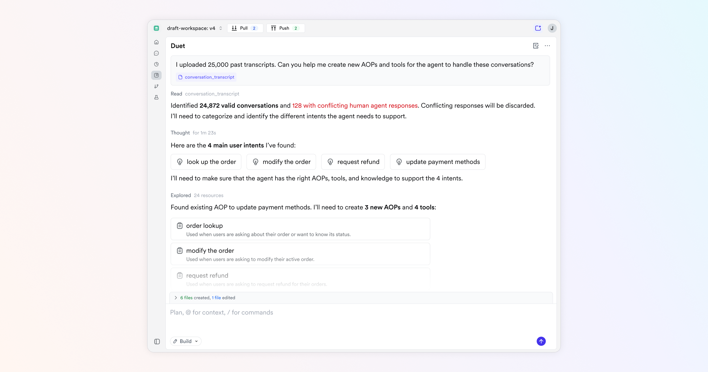

*图要点：*

- 工作区 `draft-workspace: v4`，顶栏 **Pull / Push**（类 Git）  
- 用户：「上传 25,000 条转录，帮我建 AOP 和 tools」  
- Duet：有效会话数、丢弃冲突人工回复、抽出主意图（查单/改单/退款/改支付）  
- 产出：新建 AOP 卡片 +「N files created」  

### 5.2 为 AOP 自动生成仿真测试

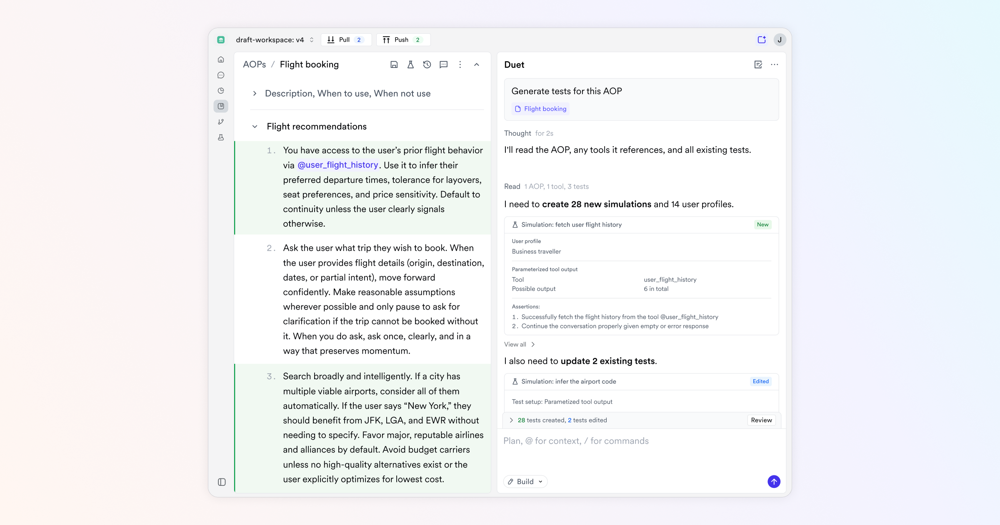

*图要点：*

- 左：AOP 正文（Flight booking，自然语言步骤 + `@user_flight_history`）  
- 右：Duet「Generate tests for this AOP」→ 拟建 28 个 simulation、14 个 user profile、Assertions  
- 底栏：`Plan, @ for context, / for commands` + **Review** 变更  

### 5.3 对京小灵

| Duet | 可对齐模块 |
|------|------------|
| 转录 → AOP | 雇佣/培训冷启动：从接待记录反推技能骨架 |
| Simulation | 能力测试 / 员工比拼的「批量场景」 |
| Root Cause / Autopilot | 质检问题 → 自动建议改标准或改技能（需人审） |

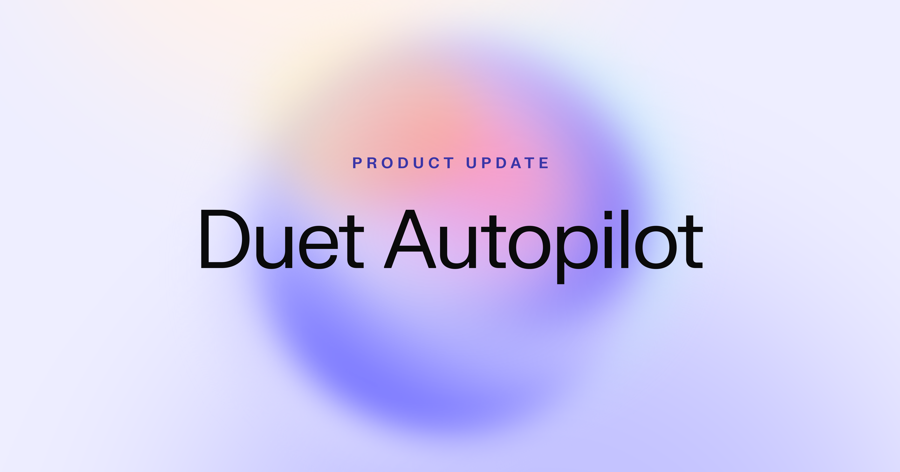

---

## 6. Watchtower：常驻会话质检

定位：对 **AI + 人工** 会话做 always-on QA。

能力要点（官网）：

1. **自然语言打标标准**（如「提到挫败感」「违反隐私政策」）  
2. 过滤器：渠道 / CSAT / 元数据 / 是否解决  
3. Rubric 多维打分  
4. Dashboard → 单通会话下钻  
5. 模板化 QA 配置（情感 / 质量 / 商机）  

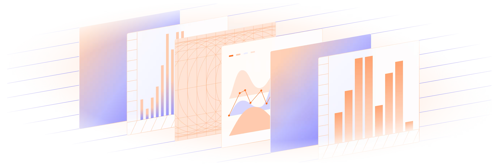

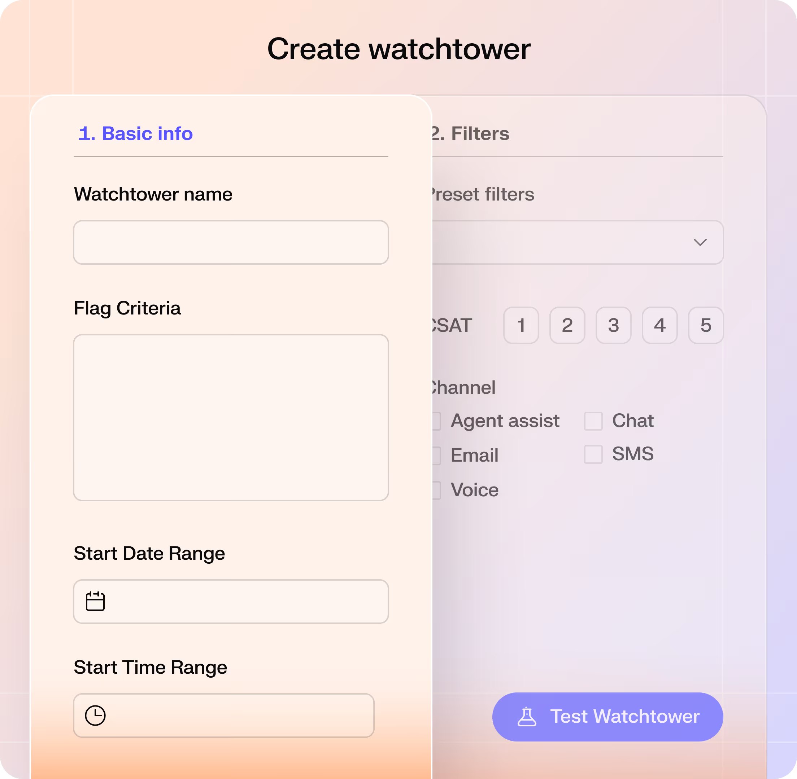

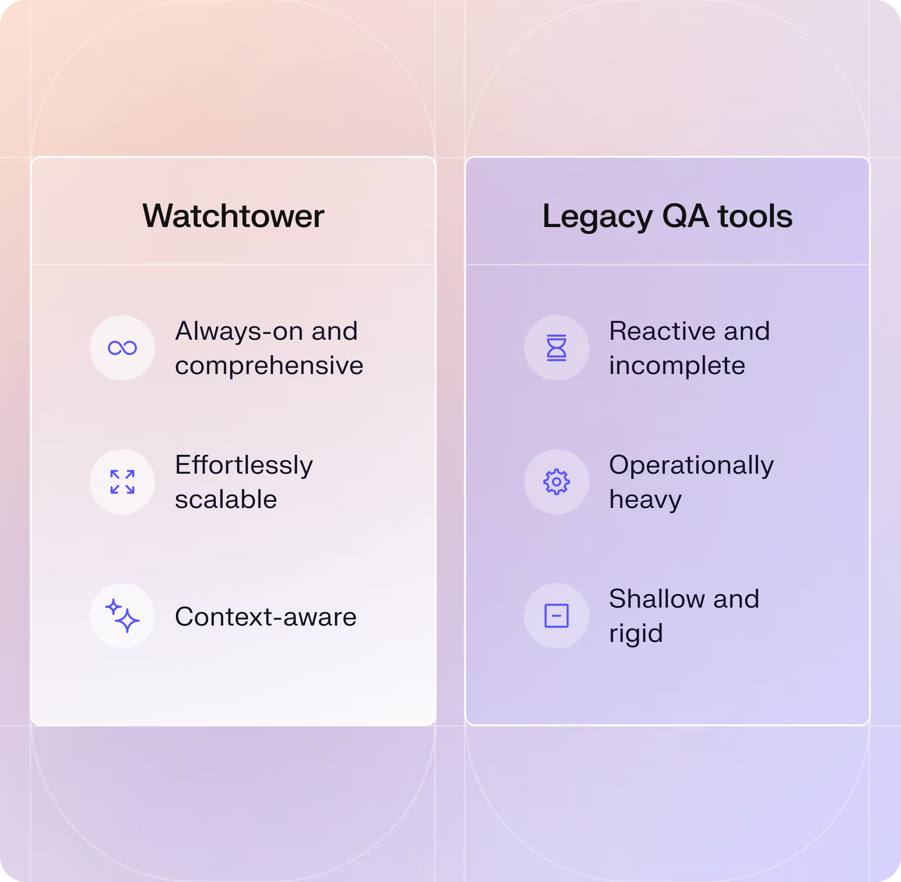

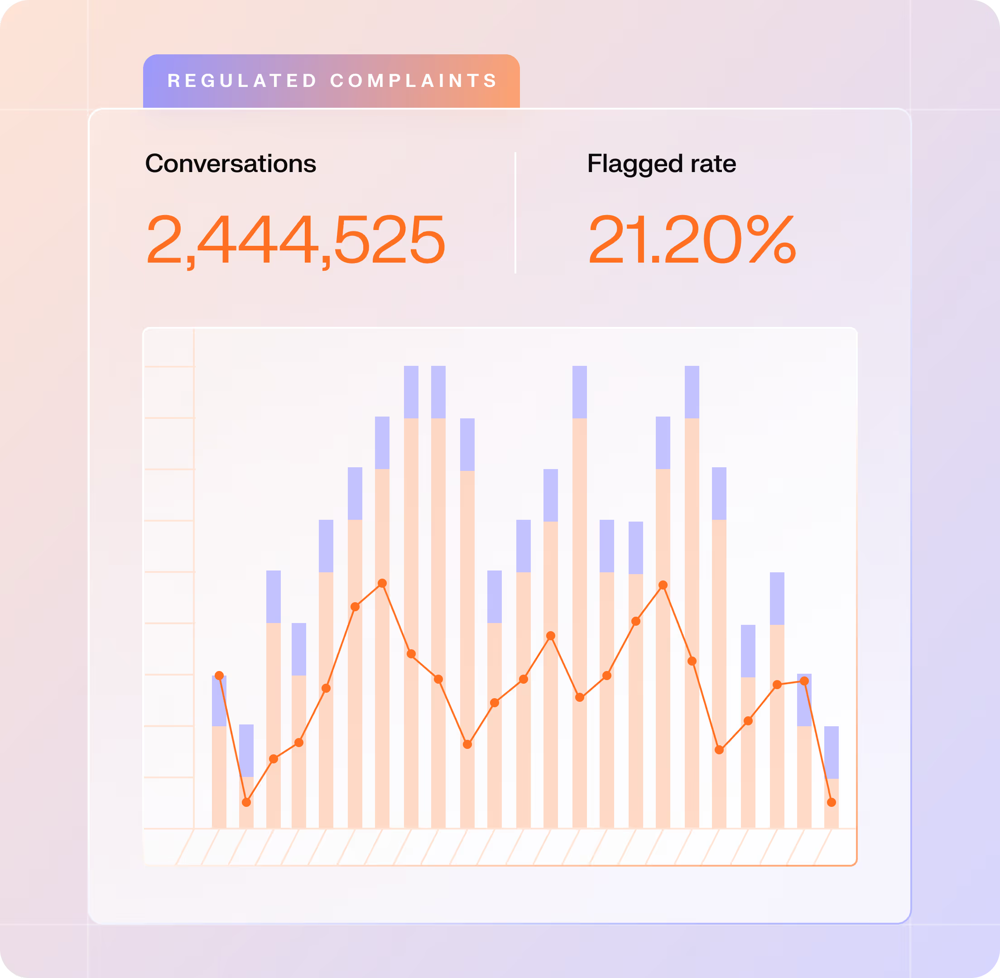

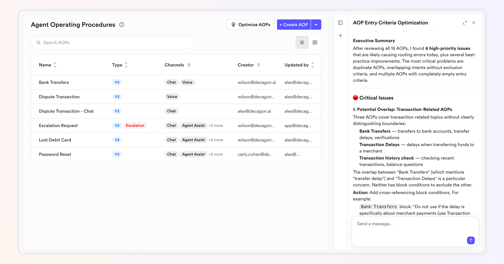

*图：Automatic Optimization / Root Cause Analysis 相关 UI（博客公开图）*

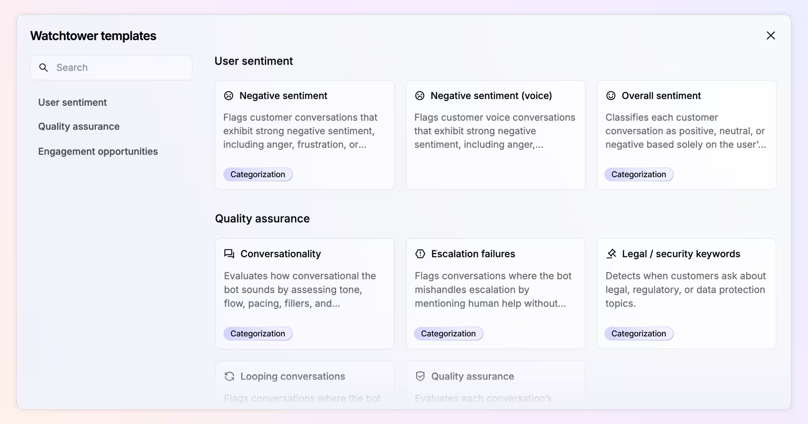

*图：AOP / Tools / Watchtower Templates*

### 对京小灵质检

| Watchtower | 京小灵质检 |
|------------|------------|
| 自然语言 Flag | 质检标准 + 提示词字段 |
| Rubric 打分 | 标准树分数 / 维度 |
| 全量扫描 | 计划 + 会话质检 |
| 模板开箱 | 市场「会话质检专员」可预置标准包 |

**可偷决策**：质检标准允许「一句话描述要抓什么」，再落到算子/模型；结果必须能从趋势点进单通会话（你们已有会话质检骨架，可加强「自然语言标准 → 可测配置」）。

---

## 7. 全渠道：Build once, deploy everywhere

主张：同一套 Agent 逻辑覆盖语音 / 聊天 / 邮件，记忆跨渠道。  
对京小灵：岗位族（在线 / 热线 / 外呼）是**分域解锁**；Decagon 是**单 Agent 多渠**。两种模型都合理——京小灵的优势是岗位与雇佣隐喻更深，短板是跨域统一「同一员工人格与技能」的叙事还不够硬。

---

## 8. 品味判断（分享时可讲）

| 维度 | 观察 |
|------|------|
| 视觉 | 浅底 + 淡紫强调，偏「干净企业 SaaS」；不如 Sierra 品牌感，也不如 Fin 编辑感 |
| 产品品味 | **强在架构编辑权**：AOP / Simulation / Watchtower / Duet 形成闭环，敢把「改 Agent」做成主路径 |
| 取舍 | 不做自助试用，只服务能付六位数、能养迭代团队的客户 |
| 与京小灵 | 同赛道「企业会话 Agent」；京小灵应用职场隐喻 + 多岗位族，Decagon 用 AOP 工程隐喻 |

一句话：**Decagon 的品味不在好看，在「什么够资格成为 Agent 逻辑」——自然语言流程必须可测、可版本、可质检。**

---

## 9. 对京小灵的 5 条可执行建议

1. **技能 = 迷你 AOP**：每条技能补齐「何时用 / 何时不用 / 升级条件」，而不只是提示词。  
2. **培训台接 Simulation**：能力测试从「试跑几轮」升级到「场景包 + Assertions」。  
3. **质检接自然语言标准**：标准录入支持一句话意图，再编译到现有字段（算子/模型/维度）。  
4. **Duet 位**：做一个「从接待记录建议技能」的只读助手，产出必须人审后入库。  
5. **版本要像 Push**：培训存档增加「草稿工作区 → 显式上岗」语义，避免改了就混进生产。

---

## 10. 分享会建议结构（15 分钟）

| 分钟 | 内容 | 用图 |
|------|------|------|
| 0–2 | 定位与结论 | — |
| 2–5 | AOP 是什么 | `14` `01` |
| 5–9 | Duet 建与测 | `17` `18` |
| 9–12 | Watchtower | `07`–`10` |
| 12–15 | 对京小灵 5 条 | 对照表 |

---

## 11. 截图清单与来源

| 文件 | 内容 | 来源 |
|------|------|------|
| `01`–`03` | Build / Optimize / Scale | decagon.ai 首页 |
| `04`–`06` | Voice / Chat / Email | 首页手风琴 |
| `07`–`10` | Watchtower | /product/watchtower |
| `11`–`16` | AOP 相关构图 | /product/aop |
| `17`–`18` | **真实产品 UI（Duet）** | 官方博客 Introducing Duet |
| `19` `22` | Duet 宣传图 | 博客 / Product Update |
| `23` `24` | Optimization / Templates | 相关博客（若本地有） |

说明：`17`、`18` 是最接近实机后台的公开 UI；其余多为官网营销图。完整实机需官方 demo。

---

## 12. 参考链接

- https://decagon.ai/product/aop  
- https://decagon.ai/product/watchtower  
- https://decagon.ai/blog/introducing-duet  
- https://decagon.ai/blog/why-we-built-decagon-duet-on-agent-operating-procedures  
- https://decagon.ai/blog/qa-breakthrough  
- https://decagon.ai/blog/templates  
- https://decagon.ai/blog/automatic-optimization  
- https://decagon.ai/vs/sierra  

---

*整理日期：2026-09-01 · 仅基于公开材料*
