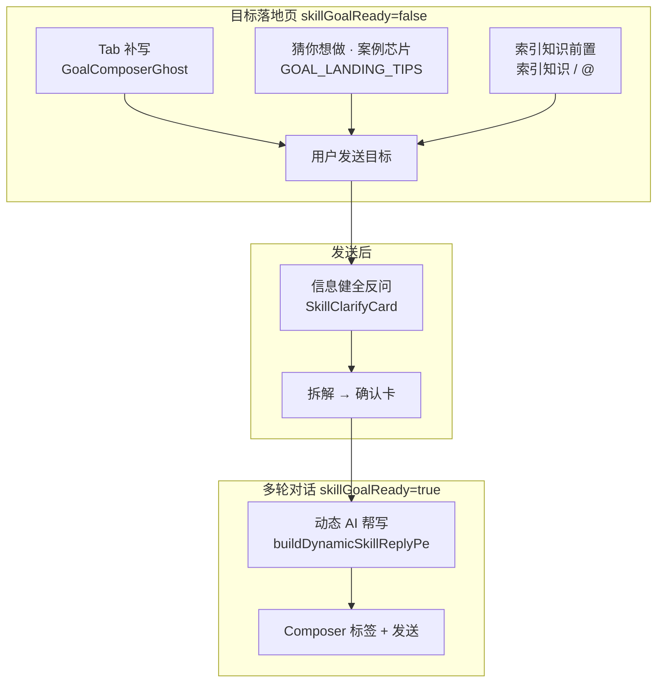
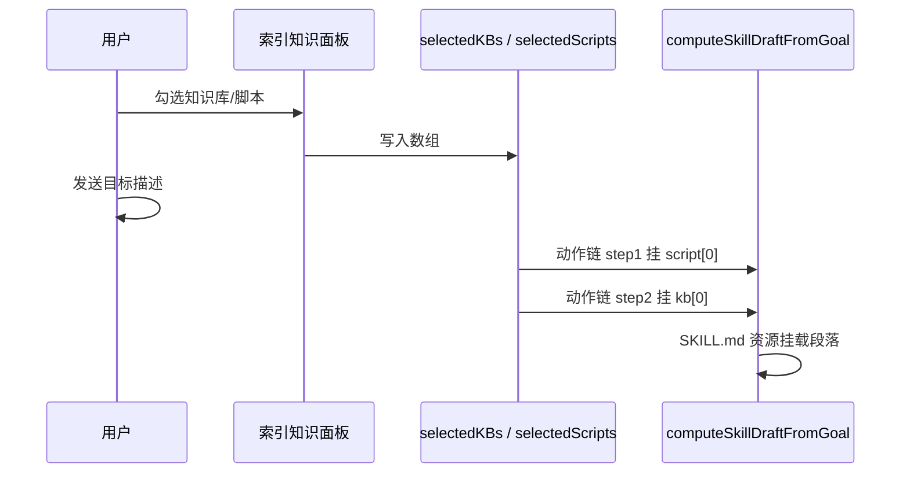
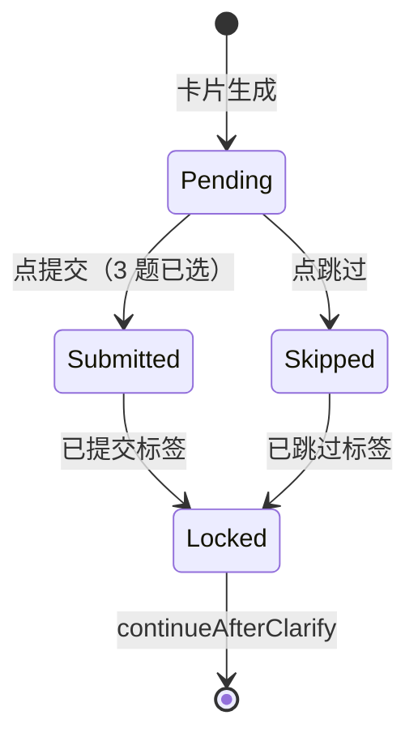
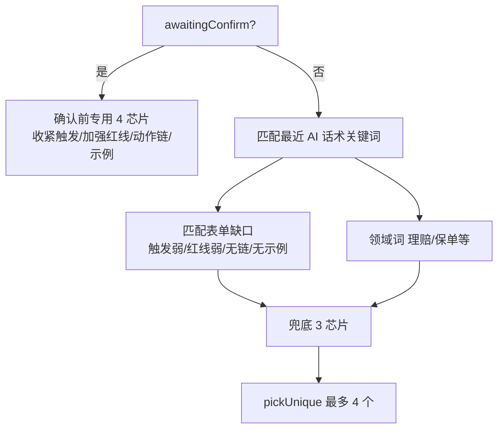
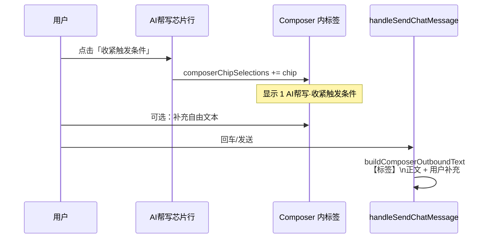
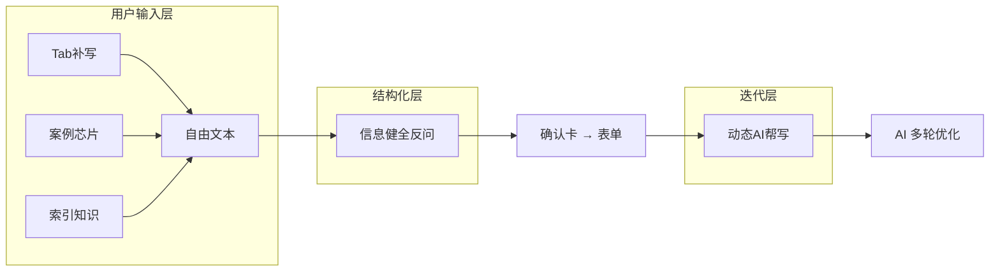

# 技能创建 · 输入增强五项功能实现说明

> **读者**：体验设计、产品、研发  
> **场景**：技能创建落地页 + 多轮对话 Composer  
> **代码入口**：`BuildSkillModal.tsx`、`lib/skillReplyPe.ts`、`lib/skillStudioMock.ts`、`SkillClarifyCard.tsx`  
> **关联**：[skill-editor-implementation-prd.md](./skill-editor-implementation-prd.md)

---

## 总览：五项功能在旅程中的位置



| 功能 | 出现阶段 | 解决的用户问题 |
|------|----------|----------------|
| **Tab 补写** | 落地页，输入框为空 | 「不知道第一句怎么写」 |
| **猜你想做（案例填充）** | 落地页，输入框下方芯片 | 「有没有可参考的完整案例」 |
| **索引知识前置** | 落地页，发送前 | 「创建时就要挂上知识库/脚本」 |
| **信息健全反问** | 首次发送目标后 | 「一句话说不清，先补结构化信息」 |
| **动态 AI 帮写** | 进入对话后 | 「接下来该说什么、怎么改」 |

---

## 1. Tab 补写

### 1.1 体验定义

- **是什么**：输入框为空时，显示灰色「幽灵文案」循环打字动画；用户按 **Tab** 或点 **Tab ⇥** 按钮，一键填入**完整技能描述**（不是只填标题）。
- **不是什么**：不是 IDE 里的代码补全；不是多轮对话里的 AI 帮写芯片。

### 1.2 界面行为

| 元素 | 行为 |
|------|------|
| 幽灵文案 | 循环展示：`帮我做一个「延保进度查询」技能` → 删除 → 下一条案例 |
| Tab 按钮 | 仅当当前条打字**完成**后出现，文案 `Tab ⇥ ，或@使用技能` |
| 快捷键 | `Tab`（输入框为空且非 Shift+Tab）→ 接受当前条 |
| 填入内容 | **完整 `pe` 段落**（约 100～200 字），不是短标题 |

**设计注意**：幽灵层是**短标题**，填入的是**长描述**——有意制造「轻提示 → 重内容」的递进。

### 1.3 实现（当前原型）

```
GOAL_LANDING_TIPS[]          // 案例库：label / hint / pe
       ↓
GoalComposerGhost            // 打字机动画，tipIndex 轮转
       ↓
acceptGoalGhostTip()         // Tab / 按钮
       ↓
applyGoalLandingTip(goalGhostTip.pe)  // setChatInput(pe)，最多 1000 字
```

**关键代码位置**

| 文件 | 符号 |
|------|------|
| `BuildSkillModal.tsx` | `GOAL_LANDING_TIPS`、`GoalComposerGhost`、`acceptGoalGhostTip` |
| `BuildSkillModal.tsx` ~4017 | `onKeyDown`：`Tab` → `acceptGoalGhostTip()` |

**显示条件**：`!chatInput && !isAiThinking` 时渲染 Ghost；用户一旦输入，Ghost 隐藏。

### 1.4 正式版建议（给研发）

| 层级 | 方案 |
|------|------|
| **MVP** | 运营配置案例列表 `{ shortTitle, fullPrompt }`；前端逻辑与现原型一致 |
| **增强** | 根据租户行业/历史技能推荐排序；Tab 填入前可预览摘要 |
| **数据** | `GET /api/skill-creation/ghost-tips?domain=物流` → `{ tips: [{ label, pe }] }` |

**验收标准**

- [ ] 空输入时 Tab 填入完整描述，光标在文末
- [ ] 有任意输入时 Tab 不抢焦点、不覆盖
- [ ] 轮转案例 ≥6 条，循环无闪屏

---

## 2. 猜你想做 · 案例填充

### 2.1 体验定义

- **是什么**：落地页输入框**下方**一排可点击芯片（延保进度查询、退换货自助、物流异常催派…），点一下**直接填入该案例的完整 `pe` 文案**。
- **与 Tab 补写的关系**：

| | Tab 补写 | 案例芯片 |
|---|---------|---------|
| 触发 | 被动看动画 + Tab | 主动点选 |
| 文案来源 | 当前轮转的那一条 | 用户指定的那一条 |
| 填入内容 | 同上，都是 `pe` 完整段 | 同上 |

两者共用 **`GOAL_LANDING_TIPS`** 数据源。

### 2.2 案例数据结构

```typescript
{
  label: '物流异常催派',           // 芯片展示 6～8 字
  hint: '包裹停滞或派送失败时…',  // 可选：tooltip / 副标题
  pe: '帮我做一个「物流异常催派」技能。用户反馈物流不更新…',  // 填入输入框的全文
}
```

当前内置 **7 条**垂直案例（延保、退换货、客诉、物流、保价、理赔、发票）。

### 2.3 实现（当前原型）

```
用户点击芯片
    ↓
applyGoalLandingTip(item.pe, tipIndex)
    ↓
setChatInput(pe.slice(0, 1000))
    ↓
同步 goalGhostTipIndex（与 Ghost 动画索引对齐）
```

**关键代码**：`BuildSkillModal.tsx` ~4293 `GOAL_LANDING_TIPS.map(...)` 芯片行。

### 2.4 正式版建议

| 项 | 说明 |
|----|------|
| **配置化** | 案例库后台可配，按业务线分组 |
| **个性化** | 根据用户部门/最近浏览技能推荐 Top4 芯片 |
| **与 Tab 统一** | 同一 API；芯片 = 显式选择，Tab = 隐式推荐当前条 |
| **埋点** | `skill_goal_tip_click`（label）、`skill_goal_tab_accept`（label） |

---

## 3. 索引知识前置

### 3.1 体验定义

- **是什么**：在**发送创建目标之前**，先把企业**知识库**和**接入脚本**挂到本次创建上下文；拆解草案时动作链步骤会默认关联已选资源。
- **入口**：
  1. 按钮 **「索引知识」**（带已选数量角标）
  2. 输入框为空时输入 **`@`** → 打开同一面板
  3. 选中后以 **芯片** 展示在输入框上方（可 × 移除）

### 3.2 界面结构

```
[📎 上传] [索引知识 · 2 ▼]
              │
              ▼ 浮层
         ┌─────────────────┐
         │ [知识库] [脚本]  │  Tab 切换
         │ 🔍 搜索…        │
         │ ☑ FAQ-退换货    │
         │ ☐ 物流状态 KB   │
         └─────────────────┘

已选芯片：[📖 FAQ-退换货 ×] [</> 订单查询接口 ×]
```

### 3.3 数据流



**落点**

| 选中资源 | 写入位置 |
|----------|----------|
| `selectedKBs` | 确认卡动作链、表单「可用资料」、生成的 `SKILL.md` 资源段 |
| `selectedScripts` | 同上，步骤 1 优先挂脚本 |

**关键 state**：`selectedKBs: string[]`、`selectedScripts: string[]`（存名称或 id，与 `PRESET_KNOWLEDGE_BASES` / 脚本目录对齐）。

### 3.4 实现（当前原型）

| 文件 | 内容 |
|------|------|
| `BuildSkillModal.tsx` | `goalResourceOpen`、`goalResourceTab`、`goalResourceQuery` |
| `BuildSkillModal.tsx` ~4107 | 「索引知识」按钮 + 浮层列表 |
| `BuildSkillModal.tsx` ~4022 | `@` 打开面板 |
| `computeSkillDraftFromGoal` | `associatedKBs: selectedKBs[0]` 等 |

**当前局限**：知识库/脚本列表为 **前端预设 + 自定义**，未接企业资源中心 API。

### 3.5 正式版建议

```http
GET /api/enterprise/resources?type=kb|script&q=物流
POST /api/skills/draft-from-goal
{
  "goal": "...",
  "mountedResources": {
    "knowledgeBaseIds": ["kb_123"],
    "scriptIds": ["script_456"]
  }
}
```

**验收标准**

- [ ] 发送前可选资源，发送后确认卡/表单/SKILL.md 均体现挂载
- [ ] 未选资源时不阻塞创建
- [ ] 芯片可删、面板内外状态一致

---

## 4. 信息健全反问

### 4.1 体验定义

- **是什么**：用户发送第一句「创建目标」后，**不立刻拆确认卡**，先弹出 **「补充信息」** 选择题卡（4 题，3 必填 1 选填），收集结构化答案再拆解。
- **目的**：把模糊自然语言拆成与**右侧四张卡**对齐的维度（是什么 / 怎么做 / 规矩 / 资源）。

### 4.2 题目与表单映射

| 题号 | 问题 | 必填 | 对应右侧卡片 |
|------|------|------|--------------|
| 1 | 主要在什么场景下触发？ | ✓ | 技能定义 · 触发条件 |
| 2 | 执行需要哪些能力？ | ✓ | 技能主体 · 知识/接口 |
| 3 | 边界情况如何处理？ | ✓ | 规范约束 · 托底/红线 |
| 4 | 是否已有知识库或脚本？ | — | 技能主体 · 资源挂载 |

每题：**单选芯片** + **添加项**（自定义选项）。

### 4.3 交互状态机



**提交后**

- Composer **禁用**（`hasPendingClarify`）直到卡片 submitted/skipped
- 调用 `continueAfterClarify` → `runGoalDraftPipeline(goal, clarifyNote)`

### 4.4 智能预填（当前规则引擎）

`buildSkillClarifyQuestions(intent)` 扫描用户目标关键词，**预选**最匹配选项：

| 用户目标含… | 预选题 1 | 预选题 2 |
|-------------|----------|----------|
| 投诉、辱骂、客诉 | 投诉/风险类话术 | 纯对话引导 |
| 查询、物流、进度 | 订单/物流查询 | 接口查询 |
| 知识库、FAQ | — | 查知识库 |
| 接口、脚本、API | — | 调用接口 |

**关键代码**

| 文件 | 符号 |
|------|------|
| `lib/skillStudioMock.ts` | `buildSkillClarifyQuestions`、`formatClarifyAnswers` |
| `SkillClarifyCard.tsx` | UI、提交/跳过 |
| `BuildSkillModal.tsx` | 首条发送 → `skill_clarify` 消息；`continueAfterClarify` |

**澄清答案如何进入拆解**

```typescript
enrichedGoal = goalText + "\n\n【补充信息】\n" + formatClarifyAnswers(questions)
// 例：
// 这个技能主要在什么场景下触发？ 订单、物流、售后进度查询
// 执行时需要哪些能力？ 知识库 + 接口组合使用
```

### 4.5 正式版建议

| 原型 | 正式版 |
|------|--------|
| 固定 4 题 | LLM 动态生成 2～5 题，题型可扩展（多选、填空） |
| 关键词预填 | 模型 + 用户历史预填，并说明「我们猜你想选」 |
| 跳过 | 保留；跳过则纯 goal 拆解 |

```http
POST /api/skills/clarify-questions
{ "goal": "...", "mountedResources": [...] }
→ { "questions": [...] }

POST /api/skills/draft-from-goal
{ "goal": "...", "clarifyAnswers": { "trigger-scene": "trigger-query", ... } }
```

**验收标准**

- [ ] 未提交澄清卡时不能继续对话发送
- [ ] 提交/跳过后才出确认卡
- [ ] 澄清答案影响拆解结果（正式版可 A/B 对比）

---

## 5. 动态 AI 帮写

### 5.1 体验定义

- **是什么**：进入多轮对话后，Composer **上方**一行 **「AI 帮写」** 快捷芯片；根据**当前对话 + 表单缺口**动态变化；支持**多选**，选中后变成输入框内 **标签**（`1 AI 帮写 · 收紧触发条件`）。
- **不是什么**：不是落地页案例芯片（那是 `GOAL_LANDING_TIPS`）；不是确认卡上的按钮。

### 5.2 出现条件

同时满足才显示：

- `skillGoalReady === true`（已过落地页）
- `!isAiThinking`
- `!hasPendingClarify`（澄清卡已处理）
- `composerReplyPe.length > 0`

> 注意：**不**因「编辑要点」模式隐藏；可与确认卡编辑并存。

### 5.3 芯片生成逻辑（规则引擎）

函数：`buildDynamicSkillReplyPe(ctx)` — `lib/skillReplyPe.ts`

**输入上下文 `SkillReplyPeContext`**

```typescript
{
  latestAiTexts: string[];      // 最近 3 条 AI 话术
  lastUserText: string;
  skillTitle: string;
  awaitingConfirm: boolean;     // 是否有未确认确认卡
  draftConfirmed: boolean;
  form: {
    cnName, businessProblem, triggerCond,
    forbiddenCond, notAllowed, usageExamples,
    actionChainSummary
  };
}
```

**优先级（从高到低）**



**示例规则**

| 条件 | 芯片示例 |
|------|----------|
| 有待确认卡 | 收紧触发条件、加强安全红线、动作链挂知识库 |
| AI 刚说「已更新触发条件」 | 接着写红线、补充禁止触发、生成默认动作链 |
| `triggerCond` 空或过短 | **补全触发条件**（插队到最前） |
| 用户目标含「理赔」 | **理赔核验话术** |

每条芯片结构：

```typescript
{ id, label: '短标签', send: '发送给 AI 的完整草稿' }
```

### 5.4 选中与发送



**合并规则** `buildComposerOutboundText`：

```
【收紧触发条件】
补触发边界：「物流异常催派」仅在…

【加强安全红线】
补安全红线：禁止越权…

（用户自己打的补充说明）
```

再次点击已选芯片 → 取消选中并移除对应块。

### 5.5 实现（当前原型）

| 文件 | 职责 |
|------|------|
| `lib/skillReplyPe.ts` | 规则生成、`append/remove/buildOutbound` |
| `BuildSkillModal.tsx` | `composerReplyPe` useMemo、`toggleComposerReplyChip` |
| `BuildSkillModal.tsx` ~4844 | 芯片行 UI |
| `BuildSkillModal.tsx` ~4885 | 标签行 UI |

### 5.6 正式版建议

| 原型 | 正式版 |
|------|--------|
| `if/正则` 规则 | **LLM 生成** 3～4 条 `{label, send}`，带缓存 |
| 固定 send 模板 | 结合当前表单字段值个性化 |
| 本地 pickUnique | 去重 + 多样性（不要四条都写触发） |

```http
POST /api/skills/composer-suggestions
{
  "messages": [...],
  "formSnapshot": {...},
  "awaitingConfirm": true
}
→ { "chips": [{ "id", "label", "send" }] }
```

**验收标准**

- [ ] 确认卡等待时芯片与优化阶段芯片不同
- [ ] 多选芯片 → 标签 → 发送合并正文
- [ ] 表单补全某字段后，对应「补全 xxx」芯片消失或降权
- [ ] 仅芯片、无手打文字也可发送

---

## 6. 五项功能协作关系（给研发的一张图）



**数据主干**：一切最终汇入 `chatInput` 发送 →（澄清）→ `enrichedGoal` → 确认卡 / 表单 state → `generateSkillMarkdown()`。

---

## 7. 文件与符号速查

| 功能 | 主要文件 | 核心符号 |
|------|----------|----------|
| Tab 补写 | `BuildSkillModal.tsx` | `GoalComposerGhost`, `acceptGoalGhostTip` |
| 案例填充 | `BuildSkillModal.tsx` | `GOAL_LANDING_TIPS`, `applyGoalLandingTip` |
| 索引知识 | `BuildSkillModal.tsx` | `goalResourceOpen`, `selectedKBs`, `selectedScripts` |
| 信息反问 | `skillStudioMock.ts` + `SkillClarifyCard.tsx` | `buildSkillClarifyQuestions`, `continueAfterClarify` |
| 动态帮写 | `skillReplyPe.ts` + `BuildSkillModal.tsx` | `buildDynamicSkillReplyPe`, `composerChipSelections` |

---

## 8. 跟研发开会可讲的「一句话版」

1. **Tab 补写**：空输入时播案例标题动画，Tab 填入该案例**完整 prompt**，降低首句门槛。  
2. **猜你想做**：同一案例库做成底部芯片，点选即填，和 Tab 共享数据。  
3. **索引知识前置**：创建前用 `@`/按钮挂 KB 和脚本，拆解时写进步骤和 SKILL.md。  
4. **信息健全反问**：首句后发 4 道选择题，答案拼进 prompt 再拆确认卡。  
5. **动态 AI 帮写**：对话阶段按上下文+表单缺口生成芯片，多选变标签，发送时合并成一条用户消息。

---

*维护：案例库、澄清题库、帮写规则变更时，请同步更新本文 §1～§5 与 `GOAL_LANDING_TIPS` / `buildSkillClarifyQuestions` / `buildDynamicSkillReplyPe`。*
