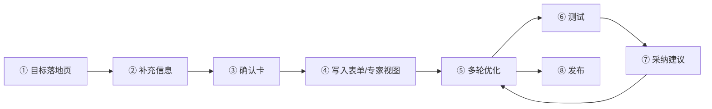
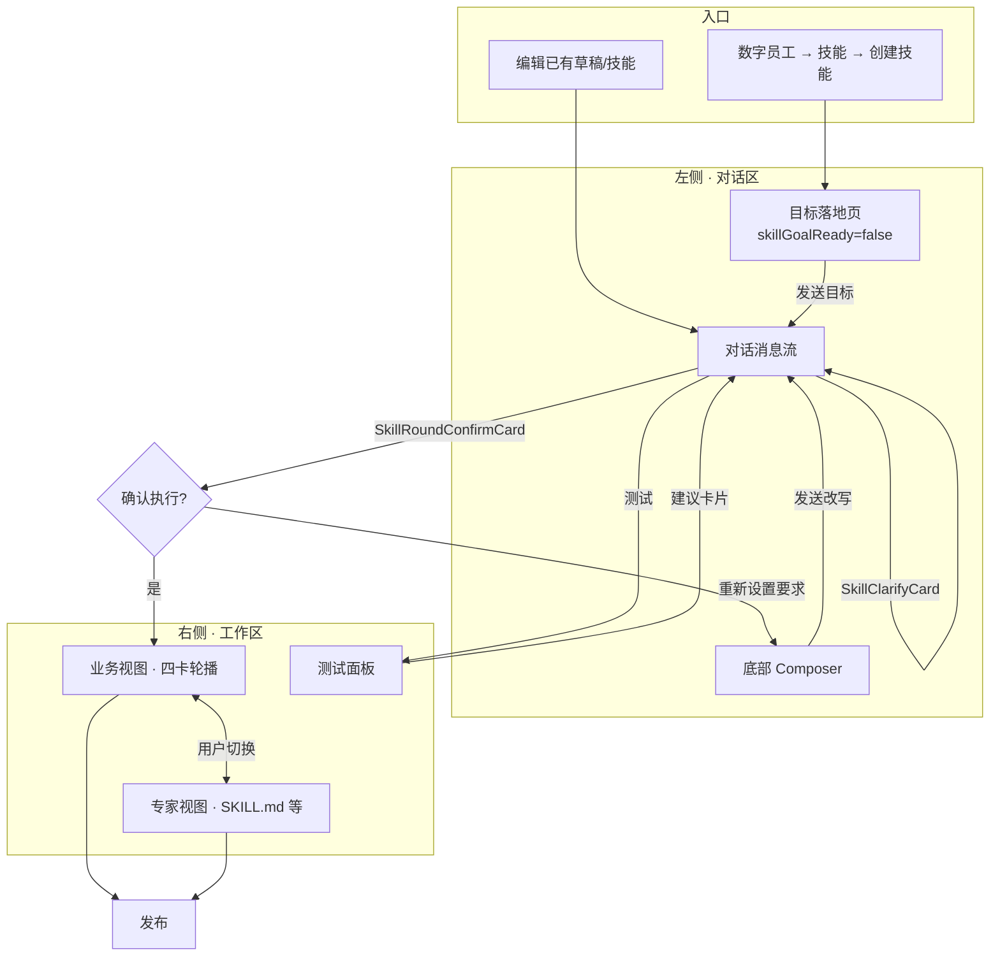
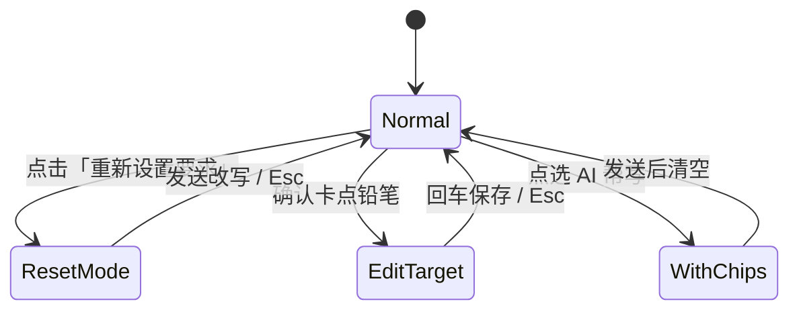
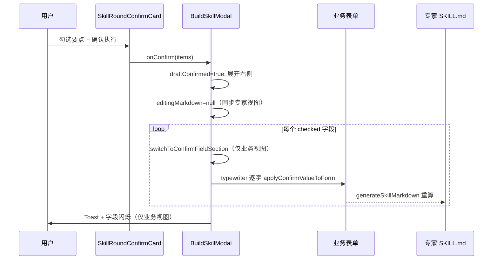
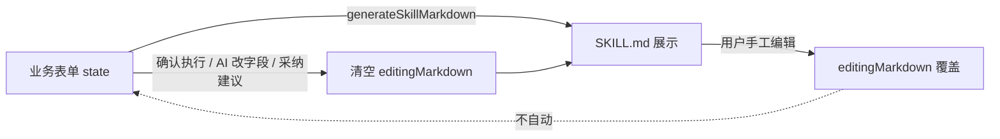

# 技能编辑器 · 体验实现说明（面向研发）

> **文档类型**：体验设计 → 研发对齐稿  
> **适用版本**：AOP 技能创建 V2（当前原型：`BuildSkillModal`）  
> **读者**：前端 / 后端 / 算法 / 测试  
> **关联 PRD**：[技能创建.md](../技能创建.md)（产品目标与范围）  
> **最后更新**：2026-08-25

---

## 1. 写这份文档要解决什么

体验设计师需要跟研发讲清楚三件事：

| 问题 | 本文档怎么答 |
|------|----------------|
| 用户从哪进、怎么走、在哪结束？ | §3 用户旅程 + 流程图 |
| 每个界面块负责什么、状态怎么切？ | §4 布局职责 + §5 状态机 |
| 现在原型里哪些是「真逻辑」、哪些要接 API？ | §9 Mock 边界 + §10 研发待办 |

**原则（请研发按此实现，不要按页面截图硬抄）：**

1. **左侧对话驱动意图，右侧承载结构化结果**——对话不拥有真相源，表单 + SKILL.md 才是可发布物。
2. **视图切换由用户决定**——业务视图 / 专家视图不随写入自动跳转，但数据必须同步。
3. **关键动作要有「可确认节点」**——大改走确认卡，小改可走对话 + 字段级确认。

---

## 2. 产品一句话

> 用户用自然语言描述「要什么技能」，AI 拆成四张业务卡片（技能定义 / 主体 / 规范 / 补充）；用户确认后写入右侧；可测试、收建议、再优化；最终编译为 SKILL.md 发布。

---

## 3. 用户旅程（主路径）

### 3.1 阶段总览



| 阶段 | 用户感知 | 系统动作 | 右侧面板 |
|------|----------|----------|----------|
| ① 目标落地 | 全屏输入「想做什么技能」 | 收集 `goalText` | 隐藏（对话全宽） |
| ② 补充信息 | 4 道选择题，可跳过 | `SkillClarifyCard` | 仍隐藏 |
| ③ 确认卡 | 勾选要点 → 确认执行 | 生成 `SkillConfirmItem[]` | 收起 → 确认后展开 |
| ④ 写入 | 看字段打字机填入 | `applyConfirmValueToForm` | 业务视图跟字段切卡；专家视图更 SKILL.md |
| ⑤ 优化 | 对话 / AI 帮写芯片 | 意图识别 → 改字段 → 可选二次确认卡 | 用户当前视图不变 |
| ⑥ 测试 | 跑用例、看通过率 | 沙箱执行（待接真 API） | 测试面板 |
| ⑦ 建议 | 看 diff、采纳/忽略 | 写回对应字段 | 同步两视图 |
| ⑧ 发布 | 填版本说明 → 校验 | 结构/安全校验 → 存草稿/发布 | — |

### 3.2 主路径详图



### 3.3 编辑已有技能（差异）

- **跳过** 目标落地页（`skillGoalReady = true`）
- **视为已确认**（`draftConfirmed = true`）
- 从 `skill.draftData` 恢复快照，直接进入「优化 / 测试 / 发布」

---

## 4. 布局与职责

```
┌─────────────────────────────────────────────────────────────────┐
│ 顶栏：返回 | [业务视图] [专家视图] | 技能测试 | 保存草稿 | 发布  │
├──────────────────────┬──────────────────────────────────────────┤
│  左侧 ~36%           │  右侧 ~64%（可收起为纯对话）              │
│                      │                                          │
│  · 消息流            │  业务视图：                               │
│    - 普通 AI/用户    │    [1技能定义][2技能主体][3规范][4补充]   │
│    - 澄清卡          │    + 当前卡片内字段表单                   │
│    - 确认卡          │                                          │
│    - 思考卡(归档)    │  专家视图：                               │
│    - 测试报告/建议   │    文件树 + SKILL.md 编辑/预览            │
│                      │                                          │
│  · AI 帮写芯片行     │  （测试为顶栏下拉面板，非第三栏）         │
│  · Composer 输入框   │                                          │
└──────────────────────┴──────────────────────────────────────────┘
```

| 区域 | 拥有什么 | 不拥有什么 |
|------|----------|------------|
| **左侧对话** | 意图、澄清答案、确认勾选、优化话术 | 不单独持久化业务字段 |
| **业务视图** | 四卡表单状态（React state → `draftData`） | 不解析用户自由文本 |
| **专家视图** | SKILL.md 文本（可手工改） | 当前**不回写**解析到表单（见 §8） |
| **AppContext** | 技能列表、草稿、发布态 | — |

---

## 5. 状态机（研发必读）

### 5.1 全局门闩

| 状态变量 | 含义 | 为 true 时 |
|----------|------|------------|
| `skillGoalReady` | 已过落地页 | 显示左右分栏 |
| `rightCollapsed` | 右侧收起 | 仅对话区；确认前常为 true |
| `draftConfirmed` | 已点过「确认执行」 | 开放自由优化、部分 AI 芯片 |
| `centerTab` | `form` / `editor` | **仅用户点击切换**，写入不自动改 |
| `isAiThinking` | AI 处理中 | 发送入队；停止按钮可用 |
| `isUpdatingForm` | 确认写入中 | 表单字段 disabled |
| `hasPendingClarify` | 澄清卡未提交 | Composer 禁用 |

### 5.2 Composer 四种模式（互斥优先级）



| 模式 | 输入区标识 | 发送行为 |
|------|------------|----------|
| **普通** | 无 | 用户文本 + 已选芯片合并发送 |
| **AI 帮写芯片** | 输入框上方 `1 AI 帮写 · xxx` 标签 | 芯片内容带 `【标签】` 块合并 |
| **编辑要点** | `N 编辑要点 · 字段名` | 只更新确认卡该行 + 对应表单字段，**不走 AI 轮次** |
| **重新设置要求** | `重新设置要求 · 编辑后发送` | 解析 `【字段名】` → 生成新确认卡 |

### 5.3 确认卡 → 写入（打字机）



**字段 → 卡片映射：**

| fieldKey | 业务卡片 | 展示标签 |
|----------|----------|----------|
| cnName, businessProblem, triggerCond, forbiddenCond, coreInputIn, coreInputOut | 1 技能定义 | 技能名称、一句话介绍… |
| actionChain | 2 技能主体 | 执行步骤 |
| notAllowed, contentRedLines, fallback | 3 规范约束 | 禁止行为、红线、托底 |
| usageExamples, customNotes | 4 补充说明 | 示例、补充资料 |

---

## 6. 四张业务卡片（表单结构）

### 6.1 卡片与必填

| # | 名称 | 必填字段（发布校验） | 选填 |
|---|------|---------------------|------|
| 1 | 技能定义 | 技能名称、英文代号、一句话介绍、触发条件、用户输入、产出物 | 不该使用的情况 |
| 2 | 技能主体 | 知识内容 **或** 挂载 KB **或** 至少 1 个步骤名 | 步骤说明、实例 |
| 3 | 规范约束 | — | 禁止行为、内容红线、托底、口径 |
| 4 | 补充说明 | — | 使用示例、补充资料 |

### 6.2 卡片导航交互

- 顶部 4 个 Tab + 左右箭头 + `N/4` 进度条
- **确认写入时**：自动切到当前字段所在卡片（仅业务视图）
- **用户手动切换**：不受写入影响（专家视图时不切卡）

---

## 7. 对话里的特殊卡片

| 卡片 | 触发 | 用户操作 | 输出 |
|------|------|----------|------|
| **SkillClarifyCard** | 首次发送目标 | 提交 / 跳过 | 澄清答案拼进拆解 prompt |
| **SkillRoundConfirmCard** | 拆解完成 | 勾选、编辑、确认、重设 | 表单写入 / 新确认卡 |
| **SkillThinkingCard** | （归档）思考完成 | 展开步骤 | 只读记录 |
| **测试进度/报告** | 点击技能测试 | 查看、重跑 | 通过率统计 |
| **测试优化建议** | 测试后有失败 | 采纳 / 忽略 / 调整 | 写回 trigger / 红线等 |

### 7.1 测试优化建议 · 展示规范（已定稿）

- **改写预览**：两行块——上行浅红底（原文）、下行浅绿底（建议），**无描边、无 +/- 图标、文字黑色**
- **采纳**：更新对应表单字段 + 专家视图同步（`editingMarkdown` 清空）

---

## 8. 业务视图 ↔ 专家视图 同步规则



| 方向 | 当前原型行为 | 建议正式版 |
|------|--------------|------------|
| 表单 → MD | 实时编译 `generateSkillMarkdown()` | 保持 |
| MD → 表单 | **不支持**（仅 `editingMarkdown` 覆盖显示） | 可选：发布前 diff 提示 / 或 MD→表单解析器 |
| 写入时视图 | **不切换** tab，用户停在哪就在哪写 | 保持 |
| 写入时数据 | 清空 MD 覆盖，以表单为准 | 保持 |

---

## 9. 当前原型 vs 正式能力（Mock 边界）

### 9.1 已是真逻辑（可保留）

- 四卡表单 state、`draftData` 快照、撤销一轮对话
- 确认卡 UI、Composer 多模式、字段映射、打字机动效
- 业务 / 专家 tab、SKILL.md 生成与手工编辑
- 校验规则、发布前门控、草稿存 localStorage（`AppContext`）

### 9.2 现为 Mock（必须接 API）

| 能力 | 原型做法 | 正式版期望 |
|------|----------|------------|
| **目标 → 拆解** | `computeSkillDraftFromGoal` 本地模板 | LLM + 澄清答案 → 结构化 JSON |
| **多轮优化** | 正则匹配「补触发/红线/动作链」 | 意图分类 + 字段级 patch |
| **思考过程** | `playThinkPlan` 未挂 UI | 流式步骤 + `SkillThinkingCard` |
| **测试执行** | 固定 82% 通过 | 沙箱 + 真实用例结果 |
| **优化建议** | 静态 `aiSuggestions` 两条 | 由失败用例 + SKILL 生成 |
| **发布校验** | 3 段 setTimeout 日志 | 结构校验 / 安全扫描服务 |
| **资源挂载** | 前端列表选择 | 企业脚本 & KB 接口 |

### 9.3 遗留双轨（研发需决策收敛）

原型里并存两条创建轨：

1. **新轨（默认）**：落地 → 澄清 → **一张大确认卡** → 写入（`chatStep=5`）
2. **旧轨（代码仍在）**：四轮对话依次填四卡（`chatStep` 1→2→3→4→5）

**建议**：产品定一条主轨，另一条标记 deprecated，避免 QA 测两套。

---

## 10. 研发待办清单（按优先级）

### P0 — 阻塞上线

- [ ] **拆解 API**：`goal + clarifyAnswers → SkillConfirmItem[]`
- [ ] **确认写入 API**（可选）：服务端校验 fieldKey/value 长度与枚举
- [ ] **测试执行 API**：用例批跑 + 失败归因到字段
- [ ] **建议生成 API**：`failedCases + currentSkill → suggestions[]`
- [ ] **发布流水线**：SKILL.md 校验、打包、版本写入

### P1 — 体验完整

- [ ] 思考卡流式展示（替换 mock timer）
- [ ] `重新设置要求` 走 LLM 重拆解，而非仅解析 `【标签】`
- [ ] 专家 MD 与表单冲突检测（发布前）
- [ ] 消息队列：`isAiThinking` 时用户消息排队发送（已有 UI，需接真异步）

### P2 — 体验 polish

- [ ] AI 帮写芯片：由模型按上下文生成（现为规则 `buildDynamicSkillReplyPe`）
- [ ] 确认写入过程可取消（`confirmTypewriterRef.cancelled` 已有钩子）
- [ ] 测试建议「调整」预填 composer 与字段联动

---

## 11. 关键接口草案（供前后端对齐）

### 11.1 拆解技能草案

```http
POST /api/skills/draft-from-goal
```

```json
{
  "goal": "做一个物流异常催派的技能",
  "clarify": { "triggerScene": "...", "capability": "...", "boundary": "...", "resources": "..." },
  "existingForm": { "cnName": "...", "...": "..." }
}
```

```json
{
  "items": [
    { "id": "triggerCond", "fieldKey": "triggerCond", "fieldLabel": "触发条件", "value": "...", "checked": true }
  ],
  "thinkPlan": { "title": "技能创建任务大纲", "steps": [...] }
}
```

### 11.2 多轮优化

```http
POST /api/skills/refine
```

```json
{
  "skillId": "optional",
  "userMessage": "补触发边界：...",
  "currentForm": { ... },
  "mode": "chat" | "reset_requirements" | "edit_confirm_item"
}
```

```json
{
  "patches": [{ "fieldKey": "triggerCond", "value": "..." }],
  "confirmCard": { "items": [...], "title": "请确认本轮变更要点" },
  "assistantMessages": ["已更新触发条件，请确认。"]
}
```

### 11.3 测试与建议

```http
POST /api/skills/{id}/test-run
POST /api/skills/{id}/optimize-suggestions
```

---

## 12. 组件与代码索引（研发查代码）

| 体验模块 | 组件/文件 |
|----------|-----------|
| 整体壳层 | `src/components/skills/BuildSkillModal.tsx` |
| 工作台入口 | `src/components/skills/SkillStudioWorkspace.tsx` |
| 确认卡 | `src/components/skills/SkillRoundConfirmCard.tsx` |
| 澄清卡 | `src/components/skills/SkillClarifyCard.tsx` |
| 思考卡 | `src/components/skills/SkillThinkingCard.tsx` |
| 专家视图 | `src/components/skills/ManusExpertFrame.tsx` |
| AI 帮写芯片 | `lib/skillReplyPe.ts` |
| 澄清/思考 mock | `lib/skillStudioMock.ts` |
| 产品 PRD 全文 | `技能创建.md` |

---

## 13. 体验验收清单（设计走查用）

- [ ] 创建新技能：落地 → 澄清 → 确认 → 写入，右侧展开且字段正确
- [ ] 专家视图点确认执行：不跳业务视图，SKILL.md 随写入更新
- [ ] 业务视图点确认：卡片随字段切换 1/2/3/4
- [ ] AI 帮写多选：标签在输入框内，发送合并内容
- [ ] 重新设置要求：可编辑后「发送改写」，出新确认卡
- [ ] 确认卡铅笔：编辑单行不回退 AI 整轮
- [ ] 测试失败：建议展示红/绿底黑字、无描边；采纳后两视图同步
- [ ] 发布：必填未填时提示，**不强制切视图**

---

## 14. 开放问题（需产品 + 研发拍板）

1. **专家视图手工改 MD 后发布**：以 MD 为准还是以表单为准？
2. **是否保留四轮对话旧轨**，还是全部收敛到「确认卡」？
3. **思考过程**是否必须在 M1 展示，还是可后置？
4. **测试建议**自动写回要不要二次确认卡，还是像现在直接改字段？
5. **ZIP 上传创建**与对话创建是否统一入口？

---

## 附录 A：对话 `chatStep` 说明（易混淆）

| chatStep | 含义 | 备注 |
|----------|------|------|
| 0–1 | 描述能力 | 旧轨首轮 |
| 2–4 | 依次填主体/规范/补充 | 旧轨 |
| 5 | 待确认 / 优化中枢 | **新轨默认落点** |
| 10、11 | 文档提及 | 代码未赋值，以 `draftConfirmed` 为准 |

---

## 附录 B：给研发的「一句话版本」

> 用户左侧说人话，AI 出**确认卡**；用户确认后，右侧**按字段打字机写入**四张业务卡并编译 **SKILL.md**；业务视图和专家视图**用户自己切**，数据从表单单向同步到 MD；测试失败出**建议 diff**，采纳改字段；最后校验发布。现在对话/测试/拆解全是 **Mock**，要换 **LLM + 测试 + 校验** 三个后端能力。

---

*文档维护：体验设计更新交互后，请同步修改 §5 状态机、§8 同步规则、§13 验收清单。*
